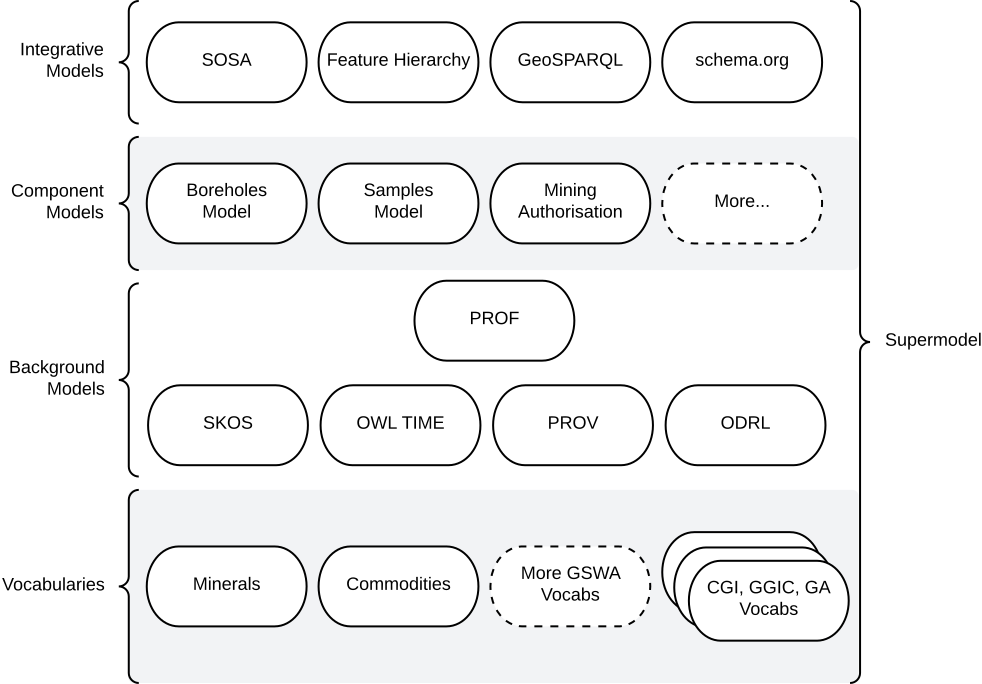

:toc: left

= Supermodel Model

A model for the integration of multiple models.

[quote, Kate Moss]
Never complain, never explain

== Metadata

[width=75%, frame=none, grid=none, cols="1,5"]
|===
|**IRI** | `https://linked.data.gov.au/def/supermodel`
|**Preferred Label** | Supermodel
|**Definition** | A Semantic Web model aimed at facilitating dataset-specific and generalised, integrative, modelling within scenarios.
|**Created** | 2021-12-10
|**Modified** | 2025-11-05
|**Issued** | -
|**Creator** | https://orcid.org/0000-0002-8742-7730[Nicholas J. Car]
|**Publisher** | -

_This model is not officially published by an Australian government organisation_
|**Provenance** | This model wan created in response to the needs of several projects that require both specialised models for different datasets and their integration. The projects were: Geoscience Australia's _Sites, Samples Surveys_ modelling and Linked Data systems upgrade in 2022, FSDF operationalisation 2022, https://linked.data.gov.au/def/qsi-supermodel[Queensland Spatial Information Addressing & Cadastral modelling 2022 - 2025], the https://data.idnau.org[Indigenous Data Network catalogue modelling, 2021-2023], the https://geological-survey-of-western-australia.github.io/GSWA-Supermodel/[Geological Survey of WA's Knowledge Graph, 2025] and the https://eia.testing.bdr.gov.au/[_EIA Demonstrator_, 2025].
|**Status** | Draft
|**Version** | `:0.0.2`
|**Code Repository** | https://github.com/nicholascar/supermodel
|**License** | https://creativecommons.org/licenses/by/4.0/[Creative Commons Attribution 4.0 International (CC BY 4.0)]
|**Copyright** | &copy; Nicholas J. Car, 2021-2025
|**Machine-readable form (RDF)** | https://linked.data.gov.au/def/supermodel.ttl
|===

== Introduction

[quote, Cindy Crawford]
I always say, even I don't wake up looking like Cindy Crawford

[.right.text-center]

_An informal overview of the https://geological-survey-of-western-australia.github.io/GSWA-Supermodel/[GSWA Supermodel] and its various parts._

This model provides a structure to the creation of sets of models that can both represent specialised datasets and allow them to be integrated. It does this by promoting the modelling of the specialised datasets while reusing modelling patterns and reference values from background models, vocabularies and datasets, as much as possible.

EXAMPLE:: Say you have two datasets that you want to integrate: *Field Measurements of Trees* and *Vegetation Height* from ariel survey. To integrate them, you will need to find as many "join" points as possible between them, perhaps: _spatial location_ - modelled in both using the same pattern, so they can be spatially queried together and also _feature property: height_ - a common way of recording the "height" property of something with common units of measure, commensurate measurement techniques etc. You could also group data from both datasets by a reporting regions background dataset, rather than just spatially intersecting them. The _feature property: height_ join point is a domain-specific pattern likely with vocabulary terms used within it, e.g. for particular methods.

=== Model Roles

Models used for data to be integrated are called _Component Models_. They necessarily model their specific dataset's unique data but should reuse patterns from _Background Models_ as much as possible and use particular values from _Background Vocabularies_ where they can too.

=== Formal Model Relations

Models in a Supermodel need to declare their dependence on other models when reusing parts from them. For example, if a _Background Model_ called *Feature Observations* has a pattern for _Feature Property Measurements_, then a _Component Model_ of *Field Measurements of Trees* implementing that pattern will need to state that it is a _profile of_ *Feature Observations*.

This statement of dependence is formalised in Supermodels using <<PROF, _The Profiles Vocabulary_>> which makes it a _Background Model_ too.

_Component Models_ much profile - depend on - as many common _Background Models_ or other _Component Models_ as possible and _Background Models_ may profile other _Background Models_ too. The Supermodel is then a set of models with all dependencies shown and no _Component Models_ depending on nothing: this would indicate they are un-integrated. Fundamental _Background Models_ will likely not depend on anything, other than perhaps modelling system models, such as <<OWL, _Web Ontology Language_>> or <<RDFS, _Resource Description Framework Schema_>>.

== Model

[quote, Linda Evangelista]
We don't wake up for less than $10,000 a day

The Model for a Supermodel is summarised as follows:

* each model is represented as a `owl:Ontology`
* each model must indicate depends on other models that it reuses elements from my use of the `prof:isProfileOf` predicate

#TODO: complete this section#

////
=== Roles
Each model and vocabulary included within an instance of a Supermodel has at least one of the following Roles assigned to it:

Integrative Model:: Role for a model that is specialised and extended by multiple models with Component Model role

Component Model:: Role for individual datasets within a Supermodels' remit which specialise and extend models with the Integrative and Background Model roles

Background Model:: Role for a model that is specialised and extended by some models with Component Model role but not all

Vocabulary:: Role for a controlled list of terms used in any of the Supermodel's models

=== Mechanisms

The Supermodel and models within it must use a consistent modelling mechanism that allows for the modelling of both the content of the various models and relations between them, as per the section next.

All Supermodels implemented to date use https://www.w3.org/standards/semanticweb/[Semantic Web] modelling techniques and, specifically, the <<RDF>>, <<RDFS>> and <<OWL>> fundamental models.

These models are given the role of _Background Model_ within a Supermodel but are often not listed in overview diagrams, due to their low-level nature.

=== Model Relations

Models within the Supermodel relate to one another in various ways. The most common way is for one to _profile_ another where profile means:

[quote]
a specification that constrains, extends, combines, or provides guidance or explanation about the usage of other specifications <<PROF>>

Within Supermodel practice, profiling another model means using elements and patterns from it and specialising and extending them while ensuring that any data conforming to the profiling model still conforms to the profiled model.

For example, a model with the _Integrative Model_ role might declare a class for `Person` and require that all `Person` instances have present one predicate of `height` indicating a `float` value. A profiling model would be free to declare a subclass of `Person` called `Student` with specialised predicates relating to student things, but it must still ensure that all instances of `Student` require a `height` predicate so that they are still valid `Person` instances.

Profiling between models within a Supermodel is indicated with the `prof:isProfileOf` predicate on the main model element, usually an instance of `owl:Ontology`.
////

== Demonstrations

[quote, Janice Dickinson (attributed)]
There are 3 billion women in the world who don't look like supermodels and only 8 that do

* https://geological-survey-of-western-australia.github.io/GSWA-Supermodel/[Geological survey of WA's Supermodel]
* https://linked.data.gov.au/def/qsi-supermodel[Queensland Spatial Information's Supermodel]
* https://linked.data.gov.au/def/eia-supermodel[Environmental Information Australia's Supermodel]
* https://linked.data.gov.au/def/abis[Australian Biodiversity Information Standard - a Supermodel]

== References

[[OWL]]
[OWL]:: World Wide Web Consortium, _OWL 2 Web Ontology Language_, W3C Recommendation (11 December 2012). https://www.w3.org/TR/owl2-overview/

[[PROF]]
[PROF]:: World Wide Web Consortium, _The Profiles Vocabulary_, W3C Working Group Note (18 December 2019). https://www.w3.org/TR/dx-prof/

[[RDFS]]
[RDFS]:: World Wide Web Consortium, _RDF Schema 1.1_, W3C Recommendation (25 February 2014). https://www.w3.org/TR/rdf-schema/