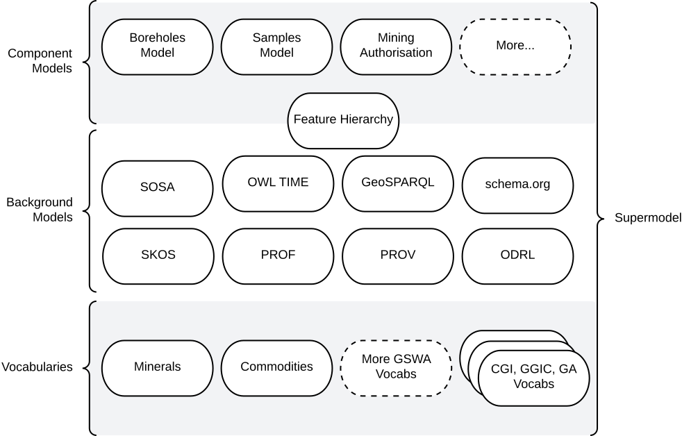
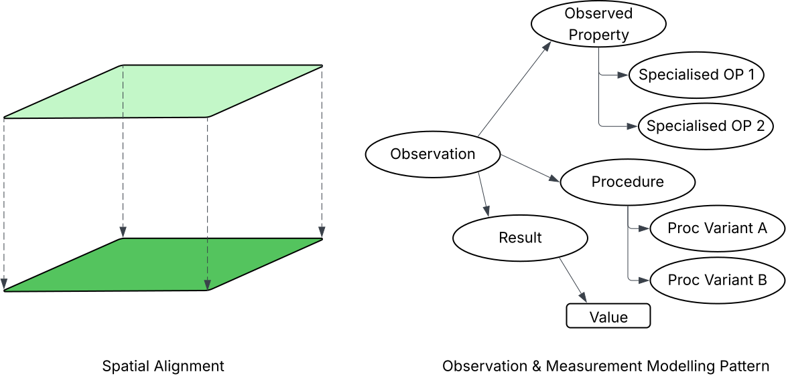
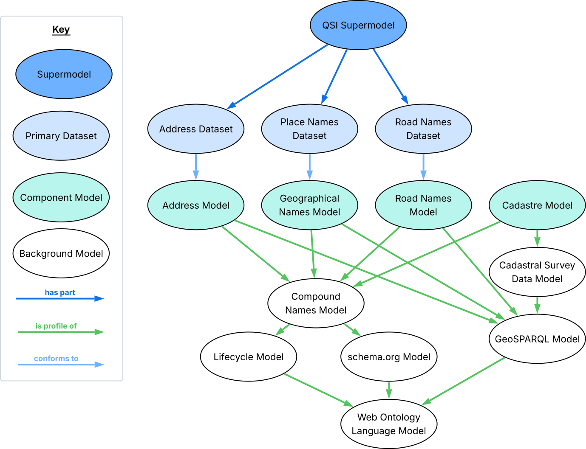

:toc: left

= Supermodel Model

A model for the integration of multiple models.

[quote, Kate Moss]
Never complain, never explain

== Metadata

[width=75%, frame=none, grid=none, cols="2,5"]
|===
|**IRI** | `https://linked.data.gov.au/def/supermodel`
|**Preferred Label** | Supermodel
|**Definition** | A Semantic Web model aimed at facilitating dataset-specific and generalised, integrative, modelling within scenarios.
|**Created** | 2021-12-10
|**Modified** | 2025-11-13
|**Issued** | -
|**Creator** | https://orcid.org/0000-0002-8742-7730[Nicholas J. Car]
|**Publisher** | https://kurrawong.ai[KurrawongAI]

_This model is not yet officially adopted by a government organisation._
|**Provenance** | This model wan created in response to the needs of several projects that require both specialised models for different datasets and their integration. The projects were: Geoscience Australia's _Sites, Samples Surveys_ modelling and Linked Data systems upgrade in 2022, FSDF operationalisation 2022, https://linked.data.gov.au/def/qsi-supermodel[Queensland Spatial Information Addressing & Cadastral modelling 2022 - 2025], the https://data.idnau.org[Indigenous Data Network catalogue modelling, 2021-2023], the https://geological-survey-of-western-australia.github.io/GSWA-Supermodel/[Geological Survey of WA's Knowledge Graph, 2025] and the https://eia.testing.bdr.gov.au/[_EIA Demonstrator_, 2025].
|**Status** | Stable
|**Version** | `:1.0.0`
|**Code Repository** | https://github.com/Kurrawong/supermodel-model
|**License** | https://creativecommons.org/licenses/by/4.0/[Creative Commons Attribution 4.0 International (CC BY 4.0)]
|**Copyright** | &copy; Nicholas J. Car, 2021-2024, KurrawongAI, 2025
|**Machine-readable form (RDF)** | https://linked.data.gov.au/def/supermodel.ttl
|===

== Abstract

A Supermodel is an enterprise data model that provides a structure for the creation of models for specialised datasets that allow for their uniqueness to be preserved but also provide for their deep integration.

This model contains two parts: a _Methodology_ and a _Model_ which describe how to approach supermodel modelling and how to formulate technical models, respectively.

== Introduction

[quote, Cindy Crawford]
I always say, even I don't wake up looking like Cindy Crawford

The Supermodel approach to modelling provides a structure to the methods of creation and technical formulation of sets of models that both represent specialised datasets and allow them to be integrated. It does this by ensuring that the modelling of the specialised datasets, while implementing custom model elements for their unique content, also reuses model elements from background models and controlled terms from vocabularies and reference datasets, as much as possible.

[.right.text-center]

[.text-center]
_An informal overview of the https://geological-survey-of-western-australia.github.io/GSWA-Supermodel/[GSWA Supermodel] and its various parts._

The figure above shows the parts of the https://www.wa.gov.au/organisation/department-of-mines-petroleum-and-exploration/geological-survey-of-western-australia[Geological Survey of Western Australia]'s Supermodel of their geological and resource sector regulation data. It shows models for specialised geological datasets such as _Boreholes_, _Samples_ and _Mining Authorisation_ as well as more generic _Background Models_ such as https://www.w3.org/TR/vocab-ssn/[_SOSA_] (for observations and measurements), http://www.opengis.net/doc/IS/geosparql/1.1[_GeoSPARQL_] (sor spatial features) and so on. It also indicates some of the vocabularies of controlled terms used by both _Component_ and _Background Models_, such as _Minerals_ and _Commodities_.

The complete documentation for the GSWA Supermodel https://geological-survey-of-western-australia.github.io/GSWA-Supermodel/[is online].

[[NOTE]]
====
**EXAMPLE**

Say you have two environmental datasets that you want to integrate: *Field Measurements of Trees* and *Aerial Vegetation Heights*. To integrate them, you will need to find as many integration points as possible between them. Clearly _spatial location_ is an easy integration point as imagery and measurements can be located, however we need more than this. We need integration on aspects of the tree & vegetation height information as well, to get commensurate data. For this, we need a model of metrology - measurement science - to tease out the _procedures_ of measurement, the _properties_ of things observed as well as _units of measure_. For this we can use https://www.w3.org/TR/vocab-ssn/[_SOSA_] as a background model as it provides defined relations for these things and indicates how similar and different _procedures_ and so on can be identified.

[.right.text-center]

Using SOSA, we can record the _Observed Properties_, _Procedures_ and _Results_ of _Observations_ and link individual datasets to different instances of them. Even though the _Procedures_ and other aspects of the data will be different, we've achieved a common data pattern integration point.

With this pattern applied to the datasets, we may be able to relate values in one to the other and therefore "deeply" integrate them.
====

=== Semantic Web

All the _formal relations_, _model roles_ and the <<Model>> given here are conceptualised as part of the formal, machine-readable, Internet of distributed resources known as the https://en.wikipedia.org/wiki/Semantic_Web[Semantic Web]. The Semantic Web is a model-driven and yet flexible way of representing concepts and the relations between them that acts as a giant, distributed, database across the Internet.

Semantic Web resources - data, models & vocabularies - are the best form of digital resources known for reuse since they require all elements to be strongly defined - nothing is left to interpretation - and they are optimised for distribution and referencing.

While many useful models are not Semantic Web models, all models can be realised as such and the Semantic Web formulation of models and data is necessary for supermodels so that many existing models can be used and so things created for a particular supermodel themselves can be maximally reused.

=== Formal Relations

Elements in a Supermodel must be identified and related in a formal (precise, machine-readable, model-defined) way, which requires modelling of the supermodel content according to the <<Model>> section below. This allows for more than just a generally organised way of arranging information that an informal _guide_ allows for, such as automated data validation, dependency mapping and aggregation of supermodels into even larger supermodels. These benefits are enormous when supermodels get large in terms of breadth and scale of data.

Critical to creating formal supermodel elements relations are element identification, declarations of dependence and conformance claims. Establishing these are detailed in the <<Methodology>> section below.

=== Model Roles

One aspect of formal supermodel element descriptions are the roles that elements play within a supermodel scope. Particular models may be for the representation of the data within datasets to be integrated are called - _Component Model_ role - or they may be used by other models as reference - _Background Model_ role - or perhaps both (see the GSWA overview figure at the top).

The roles for supermodel elements are indicated in the formal modelling of it, as per the <<Model>> section below, and the roles themselves are details in the <<Roles>> section.

== Methodology

This section describes how to create a supermodel. In outline:

1. Identify Datasets
2. Identify Dataset Models
** assume one will be implemented unless all elements of the model can be modelled using <<Background Model, Background Models>> or other Dataset's Component Models
3. Extract controlled terms
** within the datasets and models and term these <<Vocabulary, Vocabularies>>
4. Look for modelling patterns
** within the Component Models. Taken from general-purpose models
5. Identify general-purpose models
** as <<Background Model>>, for those used for modelling patterns used in Component Models
6. Formalise Relations
** the dependence of Component Models on Background Models, roles and so on, as per the <<Model>> section

=== 1. Identify Datasets

This step can be straightforward: it may be wellknown which datasets are within scope for a supermodel.

Datasets may be formulated according to any logic that makes sense to the supermodel creators. Some options are:

* by governance grouping
** consider all the data governed as a distinct part as a dataset
* by subdomain
** consider all the data within a subdomain of the supermodel as a dataset

These usually provide better datasets criteria than data by time or space as these dimensions of data can be modelled within a larger dataset.

=== 2. Identify Dataset Models

For each dataset, a formal and separate model must be either created or borrowed.

Assume that each dataset will have a Component Model, but expect and aim to deprecate any you can for shared models and Background Model reuse as this leads to better integration.

=== 3. Extract controlled terms

Lookup tables in databases, taxonomies and flat lists of controlled terms need to be extracted from datasets and models for them and placed into stand-along vocabularies. This allows for reuse of their elements across datasets creating more integration points.

=== 4. Look for modelling patterns

This is the hardest step.

It is critical to look within the models for each dataset and define small modelling patterns that can be reused in them. This pattern reuse teases out aspects of the data that can be linked across different datasets - turned into integration points - but identifying parts that can be placed into vocabularies, common classes of information and so on.

[[NOTE]]
====
It can be very hard to understand what makes for a sensible pattern without extensive knowledge of lots of reference models within a domain relevant to the supermodel at hand.

Some approaches that may assist here are:

* searching across standards bodies' models
** the https://www.w3.org[**World Wide Web Consortium**]'s fundamental models for https://www.w3.org/TR/vocab-ssn/[observations & measurement], https://www.w3.org/TR/owl-time/[time], https://www.w3.org/TR/vocab-org/[organisations], https://www.w3.org/TR/vocab-data-cube/[statistical data cubes]
** the https://www.ogc.org/[**Open Geospatial Consortium**]'s http://www.opengis.net/doc/IS/geosparql/1.1[GeoSPARQL]
* looking within the various domain portals
** https://agroportal.lirmm.fr[AgroPortal]
** https://bioportal.bioontology.org/[BioPortal]
** https://earthportal.eu/[EarthPortal]
** https://ecoportal.lifewatch.eu/[EcoPortal]
** ...
* using https://schema.org[schema.org]
** schema.org is a well-known, simple, general-purpose model

Searching for words in your domain of interest in the above locations will lead on to further resources elsewhere, as part of the <<Semantic Web>>.
====

=== 5. Identify general-purpose models

All general purpose models that have had their whole or parts reused by Component Models must be included as <<Background Model, Background Models>> within the supermodel.

=== 6. Formalise Relations

Once the above steps have been carried out, a formal description of the supermodel must be made, according to the <<Model>> below.

This means defining a `Supermodel` object, all the Component & Background Models and Vocabularies within it, as well as each's role and relations between them.

== Model

[quote, Linda Evangelista]
We don't wake up for less than $10,000 a day

=== Summary

The Model for a Supermodel is summarised as follows:

* all elements of the supermodel are modelled as instances of well-known Semantic Web model classes
** particular classes are determined by the element's role
** even when data systems are not implemented as native Semantic Web applications
* relations between elements are modelled using predicates that indicate dependence or conformance

=== Namespaces

Prefixes in the table below for https://en.wikipedia.org/wiki/Internationalized_Resource_Identifier[IRI] are used to indicate the identity of elements within this model.

[width=100%, frame=none, grid=none, cols="1,4,5"]
|===
|Prefix | Namespace | Description

| `dcterms` | `http://purl.org/dc/terms/` | Dublin Core Terms
| `ex` | `http://example.com/` | Generic examples
| `geo` | `http://www.opengis.net/ont/geosparql#` | OGC GeoSPARQL
| `owl` | `http://www.w3.org/2002/07/owl#` | Web Ontology Language ontology
| `prof` | `http://www.w3.org/ns/dx/prof/` | Profiles Vocabulary
| `rdfs` | `http://www.w3.org/2000/01/rdf-schema#` | RDF Schema ontology
| `sosa` | `http://www.w3.org/ns/sosa/` | Sensor, Observation, Sample, and Actuator ontology
| `schema` | `https://schema.org/` | schema.org model
| `skos` | `http://www.w3.org/2004/02/skos/core#` | Simple Knowledge Organization System (SKOS) ontology
| `xsd` | `http://www.w3.org/2001/XMLSchema#` | XML Schema Definitions ontology
|===

An example prefixed Semantic Web object is the https://www.w3.org/TR/skos-reference/[SKOS] model's _Concept Scheme_ class used to represent taxonomies (vocabularies) of concepts. It's full IRI is `http://www.w3.org/2004/02/skos/core#ConceptScheme` and in prefixed form is `skos:ConceptScheme`

=== Example

A complete example of a real supermodel instance - that of https://linked.data.gov.au/org/qsi[Queensland Spatial Information]'s _Queensland Spatial Information Supermodel_ online at https://linked.data.gov.au/def/qsi-supermodel - is as follows:

[.right.text-center]

The source data for the image above, in the https://en.wikipedia.org/wiki/Turtle_(syntax)[Turtle] format, is as follows:

[source,turtle]
----
<https://linked.data.gov.au/dataset/qld-addr>
    a schema:Dataset ;
    schema:name "Queensland Addresses Dataset" ;
    dcterms:conformsTo <https://linked.data.gov.au/def/addr> ;
.

<https://linked.data.gov.au/dataset/qld-place-names>
    a schema:Dataset ;
    schema:name "Queensland Place Names Dataset" ;
    dcterms:conformsTo <https://linked.data.gov.au/def/gn> ;
.

<https://linked.data.gov.au/dataset/qld-road-names>
    a schema:Dataset ;
    schema:name "Queensland road Names Dataset" ;
    dcterms:conformsTo <https://linked.data.gov.au/def/roads> ;
.

<https://linked.data.gov.au/def/addr>
    a owl:Ontology ;
    schema:name "Address Model" ;
    prof:isProfileOf
        <https://linked.data.gov.au/def/cn> ,
        <http://www.opengis.net/doc/IS/geosparql/1.1> ;
.

<https://linked.data.gov.au/def/gn>
    a owl:Ontology ;
    schema:name "Geographical Names Model" ;
    prof:isProfileOf
        <https://linked.data.gov.au/def/cn> ,
        <http://www.opengis.net/doc/IS/geosparql/1.1> ;
.

<https://linked.data.gov.au/def/roads>
    a owl:Ontology ;
    schema:name "Road Names Model" ;
    prof:isProfileOf
        <https://linked.data.gov.au/def/cn> ,
        <http://www.opengis.net/doc/IS/geosparql/1.1> ;
.

<https://linked.data.gov.au/def/cad>
    a owl:Ontology ;
    schema:name "Cadastre Model" ;
    prof:isProfileOf
        <https://linked.data.gov.au/def/cn> ,
        <https://linked.data.gov.au/def/csdm> ;
.

<https://linked.data.gov.au/def/csdm>
    a owl:Ontology ;
    schema:name "Cadastral Survey Data Model" ;
    prof:isProfileOf <http://www.opengis.net/doc/IS/geosparql/1.1> ;
.

<https://linked.data.gov.au/def/cn>
    a owl:Ontology ;
    schema:name "Compound Names Model" ;
    prof:isProfileOf
        <https://linked.data.gov.au/def/lifecycle> ,
        <https://schema.org> ;
.

<https://schema.org>
    a owl:Ontology ;
    schema:name "schema.org Model" ;
    prof:isProfileOf <http://www.w3.org/2002/07/owl> ;
.

<http://www.opengis.net/doc/IS/geosparql/1.1>
    a owl:Ontology ;
    schema:name "GeoSPARQL Model" ;
    prof:isProfileOf <http://www.w3.org/2002/07/owl> ;
.

<https://linked.data.gov.au/def/lifecycle>
    a owl:Ontology ;
    schema:name "Lifecycle Model" ;
    prof:isProfileOf <http://www.w3.org/2002/07/owl> ;
.

<http://www.w3.org/2002/07/owl>
    a owl:Ontology ;
    schema:name "Web Ontology Language Model" ;
.
----

=== Classes

* <<Profile>>
* <<Ontology>>
* <<Concept Scheme>>
* <<Dataset>>

==== Dataset

Use instances of `schema:Dataset` for elements with the role <<role-dataset>>.

==== Profile

Use an instance of `prof:Profile` for the supermodel.

==== Ontology

Use instances of `owl:Ontology` for elements with the role <<role-model>>.

==== Concept Scheme

Use instances of `skos:ConceptScheme` for elements with the role <<Vocabulary>>.

=== Predicates

* <<is profile of>>
* <<conforms to>>

==== is profile of

Use the predicate `prof:isProfileOf` to indicate the dependence of a <<Model>> on another <<Model>>.

Dependence should be indicated whenever one model reuses any elements from another.

==== conforms to

Use the predicate `dcterms:conformsTo` to indicate that a <<Dataset>> conforms to a <<Model>>.

=== Validator

With this model is supplied a validator that can be used to test conformance claims of data to it. The validator implements a number of rules ensuring that Classes and Predicates are formulated correctly and roles assigned appropriately. The validator is online at:

* https://linked.data.gov.au/def/supermodel/vaidator

Tools such as https://shacl-playground.zazuko.com/[Zazuko's SHACL Playground] or https://tools.kurrawong.ai/validate[KurrawongAI's SHACL Validator] can be used with the validator file above to test supermodel data online or the https://pypi.org/project/pyshacl[pySHACL] package can be used to validate data within Python code.

////
 e their dependence on other models when reusing parts from them. For example, if a _Background Model_ called *Feature Observations* has a pattern for _Feature Property Measurements_, then a _Component Model_ of *Field Measurements of Trees* implementing that pattern will need to state that it is a _profile of_ *Feature Observations*.

This statement of dependence is formalised in Supermodels using <<PROF, _The Profiles Vocabulary_>> which makes it a _Background Model_ too.

_Component Models_ much profile - depend on - as many common _Background Models_ or other _Component Models_ as possible and _Background Models_ may profile other _Background Models_ too. The Supermodel is then a set of models with all dependencies shown and no _Component Models_ depending on nothing: this would indicate they are un-integrated. Fundamental _Background Models_ will likely not depend on anything, other than perhaps modelling system models, such as <<OWL, _Web Ontology Language_>> or <<RDFS, _Resource Description Framework Schema_>>.
////

////
=== Roles
Each model and vocabulary included within an instance of a Supermodel has at least one of the following Roles assigned to it:

Integrative Model:: Role for a model that is specialised and extended by multiple models with Component Model role

Component Model:: Role for individual datasets within a Supermodels' remit which specialise and extend models with the Integrative and Background Model roles

Background Model:: Role for a model that is specialised and extended by some models with Component Model role but not all

Vocabulary:: Role for a controlled list of terms used in any of the Supermodel's models

=== Mechanisms

The Supermodel and models within it must use a consistent modelling mechanism that allows for the modelling of both the content of the various models and relations between them, as per the section next.

All Supermodels implemented to date use https://www.w3.org/standards/semanticweb/[Semantic Web] modelling techniques and, specifically, the <<RDF>>, <<RDFS>> and <<OWL>> fundamental models.

These models are given the role of _Background Model_ within a Supermodel but are often not listed in overview diagrams, due to their low-level nature.

=== Model Relations

Models within the Supermodel relate to one another in various ways. The most common way is for one to _profile_ another where profile means:

[quote]
a specification that constrains, extends, combines, or provides guidance or explanation about the usage of other specifications <<PROF>>

Within Supermodel practice, profiling another model means using elements and patterns from it and specialising and extending them while ensuring that any data conforming to the profiling model still conforms to the profiled model.

For example, a model with the _Integrative Model_ role might declare a class for `Person` and require that all `Person` instances have present one predicate of `height` indicating a `float` value. A profiling model would be free to declare a subclass of `Person` called `Student` with specialised predicates relating to student things, but it must still ensure that all instances of `Student` require a `height` predicate so that they are still valid `Person` instances.

Profiling between models within a Supermodel is indicated with the `prof:isProfileOf` predicate on the main model element, usually an instance of `owl:Ontology`.
////

=== Roles

These are the roles that elements within a supermodels can play. They cannot be interpreted as classes of object because roles for datasets, models and so on may vary between supermodel instances and thus are not an eternal type for that object.

The roles are a vocabulary of concepts in this hierarchy:

* <<role-dataset>>
* <<role-model>>
** <<Component Model>>
** <<Reference Data>>
*** <<Vocabulary>>
* <<Data>>
** <<Primary Data>>
** <<Reference Data>>

==== Data

`https://linked.data.gov.au/def/supermodel/role/data`

Acting as a collection of discrete or continuous values that convey information, describing the quantity, quality, fact, statistics, other basic units of meaning.

[[role-dataset]]
==== Dataset

`https://linked.data.gov.au/def/supermodel/role/dataset`

Acting as a collection of primary or reference <<Data>>.

==== Component Model

`https://linked.data.gov.au/def/supermodel/role/component-model`

Acting as a <<Model>> for a <<Dataset>> of <<Primary Data>>.

This is a child term of <<Reference Data>>.

==== Background Model

`https://linked.data.gov.au/def/supermodel/role/background-model`

Acting as a <<Model>> for a <<Dataset>> of <<Reference Data>>.

This is a child term of <<Reference Data>>.

[[role-model]]
==== Model

`https://linked.data.gov.au/def/supermodel/role/model`

Acting as an abstract information object that organises elements of data and standardises how they relate to one another and to the properties of real-world entities.

==== Primary Data

`https://linked.data.gov.au/def/supermodel/role/primary-data`

Acting as <<Data>> that is the main subject of the supermodel that may or may not be used as <<Reference Data>> also.

==== Reference Data

`https://linked.data.gov.au/def/supermodel/role/reference-data`

Acting as <<Data>> that is used as an integration point by one or more <<Dataset, Datasets>>.

==== Vocabulary

`https://linked.data.gov.au/def/supermodel/role/vocabulary`

Acting as a controlled collection of terms, usually with a hierarchy but sometimes just a list, used as <<Reference Data>> by <<Dataset, Datasets>>.

This is a child term of <<Reference Data>>.

[[NOTE]]
====
In general in the <<Semantic Web>>, vocabularies are indistinguishable from simple <<Model, Models>> but within supermodels, vocabularies should be created as lists or hierarchies of terms used to classify or categorise other objects, not as collections of complex objects.

See the https://linked.data.gov.au/def/vocpub[VocPub profile] as a model of classification vocabularies that can be folled for supermodels.
====

== Demonstrations

[quote, Janice Dickinson (attributed)]
There are 3 billion women in the world who don't look like supermodels and only 8 that do

* https://geological-survey-of-western-australia.github.io/GSWA-Supermodel/[Geological survey of WA's Supermodel]
* https://linked.data.gov.au/def/qsi-supermodel[Queensland Spatial Information's Supermodel]
* https://linked.data.gov.au/def/eia-supermodel[Environmental Information Australia's Supermodel]
* https://linked.data.gov.au/def/abis[Australian Biodiversity Information Standard - a Supermodel]

== References

[[OWL]]
[OWL]:: World Wide Web Consortium, _OWL 2 Web Ontology Language_, W3C Recommendation (11 December 2012). https://www.w3.org/TR/owl2-overview/

[[PROF]]
[PROF]:: World Wide Web Consortium, _The Profiles Vocabulary_, W3C Working Group Note (18 December 2019). https://www.w3.org/TR/dx-prof/

[[RDFS]]
[RDFS]:: World Wide Web Consortium, _RDF Schema 1.1_, W3C Recommendation (25 February 2014). https://www.w3.org/TR/rdf-schema/